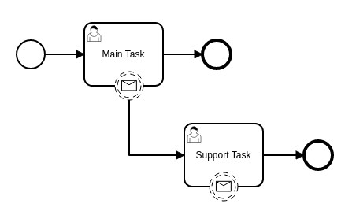

# Build & run the test

```shell
mvn clean install
```

# BPMN



# Test Scenario

1. Process is started
2. The process starts the main task
3. A message is sent to main task
4. The message spawns a first support task
5. Another message is sent to the main task
6. The message spawns a second support task
7. A message is sent to the first support task
8. The event listener of the boundary event is triggered

# Problem

The listener has no correlation with the support task instance.
We can find the 2 active event subscriptions.
There is no activity id or execution id to make the link.

# References

BPMN: src/test/resources/testProcess.bpmn
```xml
<?xml version="1.0" encoding="UTF-8"?>
<bpmn2:definitions xmlns:xsi="http://www.w3.org/2001/XMLSchema-instance" xmlns:bpmn2="http://www.omg.org/spec/BPMN/20100524/MODEL" xmlns:bpmndi="http://www.omg.org/spec/BPMN/20100524/DI" xmlns:dc="http://www.omg.org/spec/DD/20100524/DC" xmlns:di="http://www.omg.org/spec/DD/20100524/DI" xmlns:camunda="http://camunda.org/schema/1.0/bpmn" id="_7FrToMrfEeOyYYI9xhG4Cw" targetNamespace="http://camunda.org/schema/1.0/bpmn" exporter="Camunda Modeler" exporterVersion="4.6.0" xsi:schemaLocation="http://www.omg.org/spec/BPMN/20100524/MODEL BPMN20.xsd">
  <bpmn2:process id="testProcess" isExecutable="true">
    <bpmn2:startEvent id="StartEvent_1">
      <bpmn2:outgoing>SequenceFlow_1</bpmn2:outgoing>
    </bpmn2:startEvent>
    <bpmn2:userTask id="mainTask" name="Main Task">
      <bpmn2:incoming>SequenceFlow_1</bpmn2:incoming>
      <bpmn2:outgoing>SequenceFlow_2</bpmn2:outgoing>
    </bpmn2:userTask>
...
```

Test class: test.camunda.BoundaryEventListenerTest
```java
    @Test
    @Deployment(resources = {"testProcess.bpmn"})
    public void createSupportTasks() throws Exception {
        log.info("Starting process");
        ProcessInstance processInstance = runtimeService.startProcessInstanceByKey("testProcess");

        // Get main task
        Task mainTask = task("mainTask", processInstance);
        log.info("Main task: {}", asMultiLine(mainTask));

        // Create first support task
        Task firstSupportTask = createSupportTask("john", "first");
        log.info("First support task: {}", asMultiLine(firstSupportTask));
...
```

Event Listener: test.camunda.AutoCompleteListener
```java
    public void notify(DelegateExecution execution) {
        log.info("AutoCompleteListener execution: {}", asMultiLine(execution));

        String currentActivityId = execution.getCurrentActivityId(); // AutoCompleteEvent

        List<EventSubscription> eventSubscriptions = runtimeService.createEventSubscriptionQuery()
                .activityId(currentActivityId)
                .processInstanceId(execution.getProcessInstanceId())
                .list();
...
```