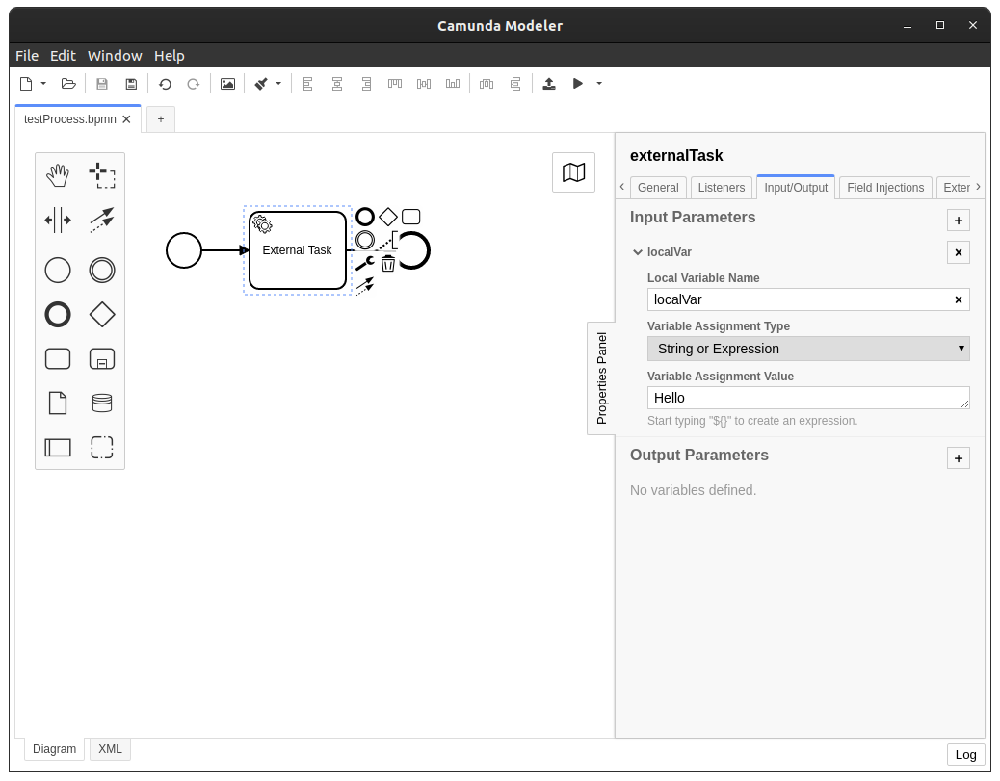

# Description

Trying to handle external task created event and use the local variables

# Problem

The event (DelegateExecution or HistoricExternalTaskLogEntity) does not contain the local variables.
If you query the local variables during the event, it returns an empty collection.
```java
    @EventListener
    public void onHistoryEvent(HistoricExternalTaskLogEntity externalTask) {
        log("HistoricExternalTaskLogEntity", externalTask);

        List<HistoricVariableInstance> variables = historyService.createHistoricVariableInstanceQuery()
                .activityInstanceIdIn(externalTask.getActivityInstanceId())
                .list();

        log.info("Variables for activity instance: {}, {}", externalTask.getActivityInstanceId(), variables);
    }
```
The result is an empty list:
```
12:19:51.962 [main] INFO  test.camunda.MyListener - Variables for activity instance: externalTask:f32565be-9d0a-11eb-b079-8af0b7b3fb84, []
```
The HistoricVariableUpdateEventEntity is fired before HistoricExternalTaskLogEntity and shows the variable
```java
    @EventListener
    public void onHistoryEvent(HistoricVariableUpdateEventEntity variable) {
        log("HistoricVariableUpdateEventEntity", variable);

        log.info("Variable for activity instance: {},  {}", variable.getActivityInstanceId(), variable);
    }
```
The result shows the variable that is set as a local input variable
```
12:19:51.954 [main] INFO  test.camunda.MyListener - Variable for activity instance: externalTask:f32565be-9d0a-11eb-b079-8af0b7b3fb84,  HistoricVariableUpdateEventEntity[variableName=localVar, variableInstanceId=f325daef-9d0a-11eb-b079-8af0b7b3fb84, revision=0, serializerName=string, longValue=null, doubleValue=null, textValue=Hello, textValue2=null, byteArrayId=null, activityInstanceId=externalTask:f32565be-9d0a-11eb-b079-8af0b7b3fb84, scopeActivityInstanceId=externalTask:f32565be-9d0a-11eb-b079-8af0b7b3fb84, eventType=create, executionId=f32565bd-9d0a-11eb-b079-8af0b7b3fb84, id=null, processDefinitionId=f324c97b-9d0a-11eb-b079-8af0b7b3fb84, processInstanceId=f324c97b-9d0a-11eb-b079-8af0b7b3fb84, taskId=null, timestamp=Wed Apr 14 12:19:51 CEST 2021, tenantId=null, isInitial=false]
```
After the transaction the variables can be queried, but they could have changed in the meantime.
```java
        ExternalTask externalTask = externalTaskService.createExternalTaskQuery().singleResult();

        List<HistoricVariableInstance> localVariables = historyService.createHistoricVariableInstanceQuery()
                .activityInstanceIdIn(externalTask.getActivityInstanceId())
                .list();

        log.info("Local variables: {}, {}", externalTask.getActivityInstanceId(), localVariables);
```
The result shows a list containing the local variable:
```
12:19:51.974 [main] INFO  test.camunda.EventBridgeTest - Local variables: externalTask:f32565be-9d0a-11eb-b079-8af0b7b3fb84, [HistoricVariableInstanceEntity[id=f325daef-9d0a-11eb-b079-8af0b7b3fb84, processDefinitionKey=testProcess, processDefinitionId=testProcess:1:f2f8142a-9d0a-11eb-b079-8af0b7b3fb84, rootProcessInstanceId=f324c97b-9d0a-11eb-b079-8af0b7b3fb84, removalTime=null, processInstanceId=f324c97b-9d0a-11eb-b079-8af0b7b3fb84, taskId=null, executionId=f32565bd-9d0a-11eb-b079-8af0b7b3fb84, tenantId=null, activityInstanceId=externalTask:f32565be-9d0a-11eb-b079-8af0b7b3fb84, caseDefinitionKey=null, caseDefinitionId=null, caseInstanceId=null, caseExecutionId=null, name=localVar, createTime=Wed Apr 14 12:19:51 CEST 2021, revision=0, serializerName=string, longValue=null, doubleValue=null, textValue=Hello, textValue2=null, state=CREATED, byteArrayId=null]]
```

# References

- Main test method: src/test/java test.camunda.EventBridgeTest#createExternalTask
- Event Listeners: src/test/java test.camunda.MyListener
- Test process: src/test/resources testProcess.bpmn

